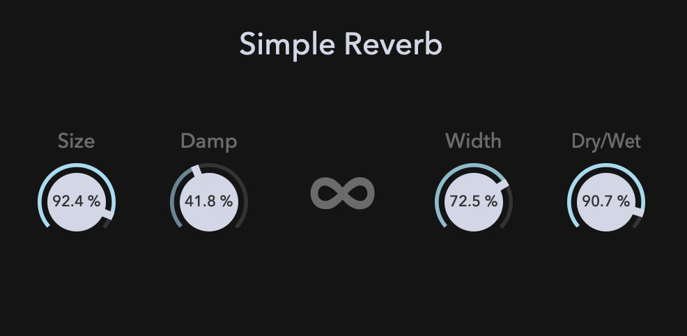

# Simple Reverb
This is a simple reverb plugin made with the JUCE DSP module.



## Building
```
$ git clone https://github.com/szkkng/SimpleReverb.git --recursive
$ cd SimpleReverb
$ cmake -S . -B build
$ cmake --build build 
```
```
# Here's Plugin.
$ ls -l build/Source/SimpleReverb_artefacts/VST3
```